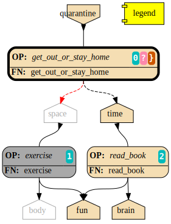

##################
Graphtik Changelog
##################

.. raw:: html

   <details>
   <summary><a>Table of Contents</a></summary>

.. contents::
.. raw:: html

   </details>

TODOs
%%%%%

- [+] ENH: planning reports unsatisfied node modus, for plotting
- [+] ENH: Plan accepts previous solutions

  - [+] fix: FnOp.compute() should (or should not?) accept Pipeline.compute() args.
  - [+] FEAT: ``compute(solution, recompute_from=["input_1"])``

Configs
=======

- [ ] FEAT: drop MANY contextvars with 1 cfg-dict in contextvars?
- [ ] FEAT: drop contextvars, use merging-dicts on (cfg, pipe, op) instead?
  BUT then cannot change configs amidst run, unless next todo ...
- [ ] FEAT: configs & op attributes accept 2-tuples: (flag, priority)
  default priorities: cfg, fnop
  (+cat: Compose)
- [ ] FEAT: Config DEBUG flags:

  - [ ] skip - evictions(drop config)
  - [ ] keep SFX in outputs

Compose
=======

- [+] feat: add a real ``implicit`` modifier.
- [?] REFACT: separate op-decorator from factory (to facilitate defining conveyor operations).
- [?] `cwd()` modifier:
  Isn't already working with relative jsonps?

  - `implicit` with only the 2nd arg should work on cwd, no?

- [ ] ++FEAT: Teach pipelines how to accept positional arguments with a tuple with their names
- [ ] ++FEAT: +1 merge method for pipelines: nest=False: treat Pipelines as Operations
  (need pipeline feat for positional-args, above).
- [ ] break/enh(modifier): augment modifier table with ``implicits`` for REPR.
- [ ] BREAK(modif): "stuffy" names for ``is_xxx(modifier)`` funcs returning stuff.
- [ ] +++FEAT: Autograph functions by type-annotations
  (PY39 :pep:`593` e.g. ``Annotated[int, CWD]``)
- [ ] +++FEAT: Autograph functions by type-annotations
- [ ] modifier || jsonp --> pandalone.pstep (flexible syntax for a modifier on each step)
- [ ] Rename modifier sfx --> token


Planning
========

- [ ] FEAT: break cycles with dijkstra; +weights?
- [ ] ++ENH: link graph inputs/outputs to virtual root-nodes, to replace custom visiting algos
  (eg unsatisfied-ops, prune-by-outs)
- [ ] FEAT: per-operation EVICTs
  (+cat: Compose)
- [ ] ++DROP PARALLEL: always produce a list of "parallelizable batches",
  to hook with other executors, and keep here just the single-process implementation.
  (+cat: Execution)


Execute
=======

- [+] FEAT: +2 callbacks before marshalling: (pre_batch, post_batch) (olds: pre_op, post_op).

  - PARTIAL: moved existing x2 callbacks to be called before marshalling.

- [?] refact: named_inputs --> sol
- [ ] ENH/REFACT: use Signature.Param from `inspect` module to match needs & zip provides
- [ ] Solution-retriever modifier `opcb()`;

  - WONTFIX: easier and more generic to access solution from Op-context.
  - REINSTATED: bc it's simpler and does not have any threading issues....

- [ ] ++FEAT(fnop): vararg(s) for Outs collect all outs to the very end
- [ ] BREAK/FEAT: allow marking SFX-LIST items:

  1. Implicits (default), to be checked/resolved downstream (see "FEAT: +2 callbacks"), or
  2. Sfx (pure), as they are now).

- [ ] +++BREAK/DROP accessors for `jsonp` (move all functionality in solution)

  - REJECTED already used for hcat()/vcat()
  - REINSTATED as "ACCESSOR per jsonp-PART"! (h/vcat should have been like that)
    by default applied to the last part (or use ``[acc, ...]`` syntax for specific parts)

  - [ ] RENAME ``Solution -->  DataTree``
  - [ ] move dep_prefixed() as a top-level `modifier` utility (to prefix also Accessors)
  - [ ] revive "stable sort paths" branch on solution updates
  - [ ] hdf/vdf accessor example-utilities for typical level-0 resolving multi-indexed slices.
  - [ ] Drop int/attribute indexers from resolve-jsonp, accessors-per-part can do that.
  - [ ] Interoperate with *Dask,* *Vaex,* *Modin* etc
    (see https://12ft.io/proxy?&q=https%3A%2F%2Ftowardsdatascience.com%2F4-libraries-that-can-parallelize-the-existing-pandas-ecosystem-f46e5a257809)
- [ ] replace in-house `jetsam` with :pep:`678` for exception notes on PY3.11+.

Solution
--------

- [+] DROP/ENH: Solution updates GivenInputs only, yet still layers jsonp-refer to its values.
- [+] FEAT: ``pd.concat()`` --> modifier+accessor, to avoid sfxed for multi-column updates.
- [+] FEAT: + `post_callback` with `pre_callback` --> `callbacks` tuple
  (+cat: Compose)

  - [+] ENH(jsonp): mass-concat (not one-by-one).
  - [+] ENH: validate Implicits indeed added (in `post_op_callback`)?
  - [ ] FEAT: VALIDATE (by user) items on Solution-Insert (with a `post_callback`?):
    - auto-assertions ``{jsonp--> validators}``
    - compare overwrites while recomputing
    - check implicits exist (??not done above??)

Plotting
========

- [+] Badges on Data
- [ ] generate legend dynamically
- [ ] Draw nested graphs as such (hiding internal nodes)
- [ ] SPHINXEXT: autodoc Pipelines & Ops
- [ ] sphinxext: extend standard ``doctest`` or *doctest* module (instead of sphinx-builder)
- [ ] FEAT/REFACT: dogfood when constructing graphviz graphs.
- [ ] FEAT: add another `dagviz <https://wimyedema.medium.com/drawing-dags-5cadcb452115>`_
  plot-backend.

Docs
====

- [ ] REFACT: move GitHub organization `pygraphkit --> pygraphtik` (+Travis, +RTD)
- [ ] Merge tutorial (operations + composition)
- [ ] +++DOC: explain Implicits in tutorial;  mention ovunque.

  - [ ] TCs: Test DEBUG


DROPPED
=======

- [X] `solution.executed` pre-populated with all operations
- [X] parallel batches restart from last position in steps
- [X] covert custom op classes & modifiers directly into mergeable networkx graphs;

  - WONTFIX bc foreign function would not work with merged deps.

- [X] conditionals

  - WONTFIX bc it permits pipelines with too complex execution flow to debug.

- [X] DROP accessors:

  - REJECTED already used for hcat()/vcat() (but to be dropped for jsnop).

v9.0.0
------

- [X] Accept jsonp inputs & outputs,

  - WONTFIX user's business to expand into given Inputs, Outputs already working.

- [X] REVERT rename subdocs;

  - WONTFIX bc eventually made it work correctly and added TC.

- [X] REFACT: separate op-decorator from factory
  (to facilitate defining conveyor operations):

  - NO, simplify passing fn=None.

- [X] Nest-rename subdocs: not by default, possible by renamer/nester.
- [X] accessors accept default (not to search x2 contain+get_path)

  - WONTFIX bc not worth it.

- [X] Simplify Task-context by injecting it in a parametric argument of `fn`.

  - NO, `opcb` modifier works without `inspect` module.

- See :gg:`1`.


Changelog
%%%%%%%%%
:GitHub Releases: https://github.com/pygraphkit/graphtik/releases

v10.5.0 (25 Apr 2023, @ankostis): REVIVE project, Bump DEPS
===========================================================

Fix all TCs and warnings for recent dependencies.

+ FIX(SITE): bump to latest sphinx:

  + FIX(TCs): bumped *jinja2*, added *MarkupSafe* and unpinned *pytest*
    so that all TCs run OK again with latest deps.
  + fix(sphinxext.TC) probably *graphviz* generates slightly different captions in SVGs.
  + fix: version-parsing in docs/conf.py neglected since v1.0 and
    manifested now as erroneously parsing pep440-version id - simplified it a lot;
    stop using forgotten packaging dep.
  + fix: ``sphinx-extlinks >= 4`` plugin demands ``%s`` also in caption or else
    pytest-fails, and a warning is issued on site generation.
  + fix(site) docutils-0.17+ broke long substitutions like ``|version|``;
    fixed it with a ``docutils.conf`` file (instead of `resorting to pinning
    <https://sourceforge.net/p/docutils/bugs/416/#4d3b>`_).
+ fix(build): unpin ``black==20.8b1`` since it's been years since ``black`` was released
  and ``pip install -e[all]`` was failing when trying to build end-of-lifed ``typed-ast``
  e.g. on Python3.11.
+ style: *black* & *isort* imports all over (with a *black* profile for the latter).
+ DOC: various nitpicks and diagram beauties.
+ DOC: add section about diffs with *schedula* project.
+ plot: various minor improvements.
+ ENH(plot) add RC-Shape badges in data-nodes
+ CHORE: TravisCI site lost :-( moved to **GitHub Actions**.


v10.4.0 (9 Oct 2020, @ankostis): CWD, callbacks non-marshalled, preserve concat index-names
-------------------------------------------------------------------------------------------
+ FEAT(compose): a :term:`current-working-document` given when defining operation
  prefixes its non-root dependencies as `jsonp` expressions.
+ feat(plot): color as "pink" any ``None``\s in the results, to facilitate identification
  of operations returning nothing, by mistake, or non-produced :term:`implicit`\s.
  Include "shape" when printing vectors (np-arrays and data-frames).
+ refact/feat(exe): the argument to :term:`callback`\s now contains the results;
  replace ``OpCb`` class with pre-existing ``_OpTask``  (now publicized).

  + Calllbacks are now called from solution context, before :term:`marshalling`.

+ ENH(solution): preserve index/column names when concatenating pandas
  (workaround https://github.com/pandas-dev/pandas/issues/13475, to be fixed with pandas-v1.2).

  + feat: ``sol.update()`` supports jsonps, and applies them grouped,
    to avoid resolving paths repeatedly.

+ doc(api): add forgotten `jsonpointer` module; updated module-dependencies diagram

|v1040-module_deps|


v10.3.0 (21 Sep 2020, @ankostis): CONCAT pandas, Hierarchical overwrites, implicit(), post-cb
---------------------------------------------------------------------------------------------
+ FEAT(solution+jsonp)): can extend in place pandas (dataframes & series) horizontally/vertically
  with :term:`pandas concatenation`.
  Usefull for when working with :ref:`Pandas advanced indexing <pandas:advanced.hierarchical>`.
  or else, sideffecteds are needed to break read-update cycles on dataframes.

  + fix(jsonp): :func:`.set_path_value()` should have failed to modify object attributes
    (but not mass-updated, utilized by :term:`accessor`\s).

+ FEAT/fix(solution): :term:`overwrite`\s work properly for non-:term:`layer`\ed solutions.

  + refact: dropped ``_layers`` solution-attribute, role passed to (existing) ``executed``.

+ FEAT(execution): support also *post*\-:term:`callbacks`.

+ FEAT/DROP(modifier): added x3 new modifiers, :func:`.vcat` and :func:`.hcat`,
  (and respective accessors), :func:`.implicit` -- dropped never-used ``accessor`` modifier.

+ FEAT: parse string explicitly passed in ``jsonp=...`` argument in modifiers.

+ feat(modifier+fnop): keep just the last part of a keyword+jsonp dependency,
  to save an explicit conversion (jsonps are invalid as python-identifiers).

+ break(modifier+fnop): forbid :term:`implicit` term:`sfxed` -- hard to find a solid use-case,
  pure `sfx` would be preferable in that case.

+ fix: forbid :term:`aliasing <alias>` implicits -- they wouldn't work anyway.

+ enh(compose): check for node type collisions (i.e. a dependency name clashing
  with some operation name).


v10.2.1 (18 Sep 2020, @ankostis): plot sol bugfix
-------------------------------------------------
+ FIX(PLOT): passing simple dictionaries into ``plot(solution=...)`` were crashing.

+ enh(plot): use also a different label (not only format) to distinguish sfx/sfxed in plots.


v10.2.0 (16 Sep 2020, @ankostis): RECOMPUTE, pre-callback, drop `op_xxx`, ops-eq-op.name, drop NULL_OP
------------------------------------------------------------------------------------------------------
Should have been a "major" release due to x2 API-BREAKs not that important.

+ FEAT(pipeline+execution): add term ``pre_callback`` to be invoked prior to computing
  each operation (see ``pre_callback`` arg in :meth:`.Pipeline.compute()`).

+ FEAT(pipeline+plan): can :term:`recompute` modified solutions, partial or complete --
  The ``recompute_from=<dep / list-of-deps>`` argument has been added to
  :meth:`.Pipeline.compute()`, :meth:`.Pipeline.compile()` & :meth:`.Network.compile()`
  methods.

+ REFACT/break(OP): replace badly-specified public attributes ``op_needs`` & ``op_provides``
  with private :attr:`.FnOp._user_needs` & :attr:`.FnOp._user_provides` -- now
  it must be easier to inherit :class:`.Operation` anew (but) UNTESTED :-().

  + refact: don't crash of operations lacking ``rescheduled``, ``marshalled``
    etc attributes.

+ ENH(OP):``Operation.name`` and ``name`` string compare *equal* -- that is,
  dictionaries of operations, such as :attr:`.Solution.executed`, can be indexed
  with their names (note, they didn't equal by accident).

  +  REFACT: move ``FnOp.__hash__()/__eq__()`` up, to Operation class.

+ FEAT/break(pipeline): replace ``NULL_OP`` operation a new ``compose(excludes=..)`` argument,
  in order to delete existing operations when merging pipelines.

+ FIX(PLAN): compile cache was ignoring(!) the state of the :term:`eviction` flag.

+ FIX(execution): solution ``copy()`` was crashing (for 9 months till now).

+ ENH(plot): make all nodes "filled" to facilitate hovering for tooltips.

+ fix(plot): "overwrite" tooltip was written "overridden".

+ fix(plan): bug when printing a list of "unsolvable graph" error-message.

+ FIX(TEST): ``exemethod`` fixture's ``exe_method`` was always empty when interrogated
  for deciding "xfail"s.

+ enh(build): pin ``black`` version, changes in format affect commits.

+ doc(parallel): Deprecate(!), but just in docs, in favor of always producing
  a list of "parallelizable batches", to fed to 3rdp parallelizing executors.

+ doc(execution+fnop): Mark mark :data:`.execution.task_context` as *unstable API*,
  in favor of supporting a specially-named function argument to receive the same instances.

+ doc(site+doctests): use greek letters in algebraic formulas AND dependencies.


v10.1.0 (5 Aug 2020, @ankostis): rename return-dict outs; step number badges
----------------------------------------------------------------------------

FEAT(op): :func:`.keyword` modifier can rename outputs of a :term:`returns dictionary`
function.

+ fix: rescheduled function err-msg were listing wrong missing provides.
+ enh: err-msg did not list returns-dict mismatches.

+ ENH(plot): add number badges on operations & data nodes to denote execution order;
  theme ``show_steps=False`` can hide them;

  + feat: data-nodes are *Graphviz HTML-ized* to support badges.

+ break(fnop): do not accept operations without any `provides` - they were pruned before,
  but it is better to fail asap.

  + fix/break: clip extra data from a :term:`returns dictionary` function - previously,
    full-eviction assertion was kicking.

+ enh(plan): why operations are pruned is now explained in the plan & the plot tooltips.

+ fix(plan): :meth:`.ExecutionPlan.validate()` may be called with no args,
  and uses the compiled ones.

  + enh: suggest mode of action on the error message, when graph has cycles;
    top-sort nodes only once, and report them to `jetsam` (see below).
  + doc: enhance existing tutorial section to explain compilation.

+ feat(:term:`jetsam`): `pipeline` was not collected, till now.

  + FEAT: items can be accessed as jetsam attributes (helpful for interactive REPLs).
  + ENH: don't "catch" exception, use ``try-finally`` with ``ok`` flag instead,
    not to corrupt the landing position of a post-mortem debugger.
  + feat: now collecting also ``pruned_dag``, ``op_comments``, ``sorted_nodes`` while
    :term:`compiling <compile>`.
  + revert: stop logging every jetsam item on each salvaging point, not to flood
    logs (which had been introduced in the previous release).
  + refact: move into own module.

+ fix(SphinxExt): catch top-level errors that if occurred, message and stack trace
  were lost.

+ doc: list anti-features (when to avoid using this lib).


v10.0.0 (19 Jul 2020, @ankostis): Implicits; modify(); auto-name pipelines; plot data as overspilled
====================================================================================================
+ FEAT: new :term:`implicit` modifier doing a better job than :func:`.sfx`.
+ FEAT(pipeline): auto-derive name from enclosing function.
+ BREAK/fix(modifier): rename modifier ``jsonp =>`` :func:`.modify()`;
  parameter ``jsonp=False`` now works.
+ FEAT(jspoint): descend object attributes were disabled before.
+ ENH(modifier): privatize all fields (`str` with foreign attributes interact badly
  with 3rdp libs).
+ ENH(plot): stackable tooltips; now data nodes kind and state is fully explained there.

  + enh: split jsonp data nodes in separate lines forming a tree.
  + enh: label overspill data-node's shapes.
  + enh: theme-stack now expands any callables in keys or whole kv-pairs.
  + feat: ``show_chaindocs=False`` them attribute now hides even subdoc relationships
    (edges).
  + fix: various fixes & enhancements ("canceled" were misattributed,
    update legend, infective user ``'graphviz.xxx"`` attributes,
    plotting no-edge diagrams)

+ enh(planning): explained why nodes were pruned in ``DEBUG`` logs.
+ enh(:term:`jetsam`): exception-annotated contents accessed also as attributes.
+ doc(debug) improve instructions.
+ enh(tests): check library also with ``DEBUG`` logging level.


v9.3.0 (8 Jul 2020, @ankostis): Sphinx AutoDocumenter; fix plot sfx-nodes
=========================================================================
- FIX/FEAT(SPHINXEXT): so far, :func:`.operation`-annotated module functions were
  excluded from generated sites.  Until the installed *autodoc* function-documenter
  was instructed how to render the  wrapped function in place of the wrapping
  ``FnOp``:

  - fix(fnop, pipeline): wrapped function attributes are conveyed to wrapping `FnOp`.

- FIX(plot): sideffect templates were left broken by recent privatization
  of modifier fields;  add x2 Jinja-filters encapsulating the access to these fields.
- fix(op): fully fake callables by attaching a ``__qualname__`` property on operations;
  also teach :func:`.func_name()` not to choke if ``__qualname__`` missing.


v9.2.0 (4 Jul 2020, @ankostis): Drop MultiValueError
----------------------------------------------------
Delayed raising of needs errors hindered debug.


v9.1.0 (4 Jul 2020, @ankostis): Bugfix, panda-polite, privatize modifier fields
===============================================================================
- BREAK(modifier): privatize all :class:`._Modifier` properties;  it is uncanny
  for a str to have more public attributes.
- fix: avoid equality checks on results, to avoid pandas notorious
  "The truth value of a Series/DataFrame is ambiguous."
- break(plot): Rename theme property ``include_steps => show_steps``.
- feat(plot): new theme property ``show_chaindocs`` by default false,
  that when enabled, plots all nodes in the subdoc hierarchy (even if those
  not used as deps), like this::

      pipeline.plot(theme={"show_chaindocs": True})

- fix(plot): returns-dictionary op-badge had broken url.


v9.0.0 (30 Jun 2020, @ankostis): JSONP; net, evictions & sfxed fixes; conveyor fn; rename modules
=================================================================================================
+ FEAT(modifier): Dependencies with :term:`json pointer path` that can read/write
  :term:`subdoc`\s (e.g. nested dicts & pandas).

  + feat(config): added :func:`set_layered_solution()` into :term:`configurations`
    which when True (or *jsonps* in the network if None (default)) all results
    are stored in the given inputs to the pipeline
    (this may become the regular behavior in the future).
  + feat(modifier, solution): +modifier with accessor functions to read/write Solution.
  + doc: new section :ref:`hierarchical-data` putting together all advanced features
    of the project in a "Weekly task runner".

+ BREAK/REFACT: modules and objects renamed:

  +---------------------------------+-----------------------------+
  | FROM                            | TO                          |
  +=================================+=============================+
  | :file:`modifierS.py`            | :file:`modifier.py`         |
  +---------------------------------+-----------------------------+
  | func: modifiers.fn_kwarg        | :func:`.modifier.keyword()` |
  +---------------------------------+-----------------------------+
  | :file:`network.py`              | :file:`planning.py`         |
  +---------------------------------+-----------------------------+
  | :file:`op.py`                   | :file:`fnop.py`             |
  +---------------------------------+-----------------------------+
  | class: op.FunctionalOperation   | :class:`.fnop.FnOp`         |
  +---------------------------------+-----------------------------+

+ FEAT(op): default :func:`.identity_function()` acting as :term:`conveyor operation`.
+ FIX(NET, EXECUTION): discovered and fixed bugs in pruning, evictions and rescheduling
  with overwrites, while testing new `jsonp` modifier;  rely on dag alone while pruning
  (and not digging into op needs/provides).

  - Dupe Evictions of pruned output were deliberately & wrongly consolidated, while
    it is possible to need to evict repeatedly the same out from multiple ops
    providing it.
  - Less aggressive prune-isolated-data permits SFX not to be asked explicitly,
    and behave more like regular data.
    Now For certain cases, the more specific error "Unreachable out" gets raised,
    instead of the too generic "Unsolvable graph".
  - Prune-by-outputs was ignoring given inputs, chocking on computation cycles
    that were possible to avoid!

+ DROP(net): ``_EvictionInstruction`` class was obscuring modifier combinations, and
  it didn't make sense any more, being the only instruction.
+ FEAT(ops, pipelines, net, sol): unified :meth:`.Plottable.ops` utility properties.
+ ENH: Error reporting:

  + enh(op, pipe): fail earlier if no function/name given when defining operations
    and pipelines.
  + enh(op): when :envvar:`GRAPHTIK_DEBUG` var defined, any errors during inputs/needs
    matching are raised immediately.
  + enh: improve tips & hints in exception messages;  log past executed operations
    when a pipeline fails.

+ DOC(op): table explaining the differences between various dependency attributes of
  :class:`.FnOp`.

  .. include:: ../../graphtik/fnop.py
      :start-after: .. dep-attributes-start
      :end-before: .. dep-attributes-end

+ enh(op, pipe): restrict operation names to be strings (were :class:`collection.abc.Hashable`).
+ feat(modifier): public-ize :func:`modifier_withset()` to produce modified
  clones -- handle it with care.
+ feat(doc): Add new section with most significant :ref:`features` of this project.
+ fix(travis): update `pytest` or else `pip-install chokes with
  <https://travis-ci.org/github/ankostis/graphkit/jobs/700326904>`_ `pytest-coverage` plugin.
+ enh(pytest): add ``--logger-disabled`` CLI option when running TCs, as explained
  in `pytest-dev/pytest#7431 <https://github.com/pytest-dev/pytest/issues/7431>`_.
+ refact(tests): split big :file:`test/test_graphtik.py` TC file into multiple
  ones, per functionality area (features).


v8.4.0 (15 May 2020, @ankostis): subclass-able Op, plot edges from south-->north of nodes
=========================================================================================
+ ENH(pipe): nest all Ops (not just FnOps), dropping ``FnOp``
  dependency in network code, to **allow for further sub-classing** :class:`Operation`.
+ FIX(pipeline): due to a side-effect on a ``kw`` dictionary, it was mixing the attributes
  of earlier operations into later ones while merging them into pipelines.
+ REFACT(solution): facilitate inheriting Solution by extracting :meth:`
  .Solution._update_op_outs` into a separate method.
+ refact(pipe): move `build_net()` --> back to `pipeline` module,
  dropping further network.py-->pipeline.py mod-dep.
+ enh(plot): StyleStack-ize data-io shape selection into separate theme-able dicts.
+ DOC(exe, plotting): task-context section in Debugger


v8.3.1 (14 May 2020, @ankostis): plot edges from south-->north of nodes
=======================================================================
+ ENH(plot): have all the link-edges between data and operations route out and into
  the same point on the nodes (src: south, dst: north).
  Distinguish needs edges from provides with a "dot".

v8.3.0 (12 May 2020, @ankostis): mapped-->keyword, drop sol-finalize
====================================================================
+ BREAK: rename ``mapped --> keyword``, which conveys the mot important meaning.
+ DROP Solution.finalized() method -- has stopped being used to reverse values
  since sfxed have been introduced (v7+).
+ doc(modifiers): explain :term:`diacritic` symbols of dependencies when in printouts.


v8.2.0 (11 May 2020, @ankostis): custom Solutions, Task-context
===============================================================
+ FEAT(exe): ``compute()`` supports custom Solution classes.
+ FEAT(exe): underlying functions gain access to wrapping Operation with :data:`.execution.task_context`.


v8.1.0 (11 May 2020, @ankostis): drop last plan, Rename/Nest, Netop-->Pipeline, purify modules
==============================================================================================
+ DROP(pipeline): After solution class was introduced, ``last_plan`` attribute was redundant.

+ ENH(op): Rename & Nest operations with dictionary or callable.

+ FEAT(pipeline): :data:`.NO_RESULT_BUT_SFX` token can cancel regular data but leave
  sideffects of a rescheduled op.

+ REFACT: revert module splits and arrive back to :mod:`base.py`, :mod:`fnop.py` &
  :mod:`pipeline.py`, to facilitate development with smaller files, but still
  with very few import-time dependencies.

  Importing project :term:`composition` classes takes less than 4ms in a fast 2019 PC
  (down from 300ms).

+ FIX(plot): updated Legend, which had become outdated since v6+.

+ fix(modifiers): `dep_renamed()` was faking sideffect-renaming only on repr()
  (but fix not stressed, bc v8.0.x is not actually released).
+ enh(pipe): accept a dictionary with renames when doing :term:`operation nesting`
  (instead of callables or truthies).
+ refact(op): force abstract :class:`.Operation` to be :class:`.Plottable`.
+ enh(modifiers): add :attr:`._Modifier.cmd` with code to reproduce modifier.


v8.0.2 (7 May 2020, @ankostis): re-MODULE; sideffect --> sfx; all DIACRITIC Modifiers; invert "merge" meaning
=============================================================================================================
**--((superseded immediately v8.0.1 & v8.0.2 with more restructurings)))--**

+ BREAK: restructured ``netop`` && ``network`` modules:

  + BREAK: stopped(!) importing :mod:`.config` top-level.
  + BREAK: :mod:`.network` module was splitted into :mod:`.execution` which now
    contains plan+solution;
  + BREAK: unified modules ``op`` + ``netop`` --> :mod`.composition`.
  + DOC: module dependencies diagram in :doc:`reference`;
    now x60 faster ``import composition`` from 300ms --> 5ms.

+ BREAK: sideffect modifier functions *shortened* to :func:`.sfx` & :func:`.sfxed`.

  + FEAT: +Sideffected :term:`varargish` -- now :term:`sideffected` fully mirror
    a regular dependency.
  + ENH: change visual **repr**\esentation of modifiers with DIACRITICS only.
  + refact(modifiers): use cstor matrix to combine modifier arguments; new utility
    method for renaming dependencies :func:`.dep_renamed()`
    (usefull when :ref:`operation-nesting`, see below).
  + ENH: possible to rename also sideffects;  the actual sideffect string is now
    stored in the modifier.

+ BREAK/ENH: invert ":term:`merge <operation merging>`" meaning with (newly introduced)
  ":term:"nest <operation nesting>`"; default is now is merge:

  + FEAT: introduce the ``NULL_OP`` operation that can "erase" an existing
    operation when merging pipelines.
  + ENH: ``compose(..., nest=nest_cb)`` where the callback accepts class ``.RenArgs``
    and can perform any kind of renaming on data + operations before :term:`combining
    pipelines <combine pipelines>`.
  + doc: "merge" identically-named ops override each other, "nest" means they are prefixed,
    "combine" means both operations.
  + DOC: re-written a :ref:`merge-vs-nest tutorial <operation-merging>` for humanity.

+ DROP(op): `parent` attribute is no longer maintained -- operation identity now
  based only on name, which may implicitly be nested by dots(``.``).
+ ENH(plot): accept bare dictionary as theme overrides when plotting.
+ doc: fix site configuration for using the standard ``<s5defs>`` include
  for colored/font-size sphinx roles.


v8.0.0, v8.0.1 (7 May 2020, @ankostis): retracted bc found more restructurings
------------------------------------------------------------------------------
**--((all changes above in b8.0.2 happened actually in these 2 releases))--**


v7.1.2 (6 May 2020, @ankostis): minor reschedule fixes and refactoring
======================================================================
Actually it contains just what was destined for v7.1.1.

+ FIX(op): v7.0.0 promise that ``op.__call__`` delegates to ``compute()`` was a fake;
  now it is fixed.
+ fix(config): endurance flags were miss-behaving.
+ refact(net): factor out a :meth:`._reschedule()` method for both endurance & rescheduled ops.
+ feat(build): +script to launch pytest on a local clone repo before pushing.

v7.1.1 (5 May 2020, @ankostis): canceled, by mistake contained features for 8.x
--------------------------------------------------------------------------------
(removed from PyPi/RTD, new features by mistake were removed from v7.1.2)


v7.1.0 (4 May 2020, @ankostis): Cancelable sideffects, theme-ize & expand everything
====================================================================================
|v440-flowchart|

Should have been a MAJOR BUMP due to breaking renames, but just out of
another 6.x --> 7.x major bump.

NET: fix rescheduled, cancelable sfx, improve compute API
---------------------------------------------------------
+ FIX: rescheduled operations were not canceling all downstream deps & operations.
+ FEAT: Cancelable sideffects: a :term:`reschedule`\s operation may return
  a "falsy" sideffect to cancel downstream operations.

  + ``NO_RESULT`` constant cancels also sideffects.

+ ENH(OP): more intuitive API, ``compute()`` may be called with no args,
  or a single string as `outputs` param.  Operation's ``__call__`` now delegates
  to ``compute()`` - to quickly experiment with function, access it from the
  operation's :attr:`.FnOp.fn` attribute

MODIFIERS: modifier combinations, rename sol_sideffects
-------------------------------------------------------
+ BREAK: renamed modifiers ``sol_sideffect --> sideffected``, to reduce terminology
  mental load for the users.
+ ENH: support combinations of modifiers (e.g. optional sideffects).
+ REFACT: convert modifiers classes --> factory functions, producing :class:`._Modifier`
  instances (normally not managed by the user).

PLOT: them-ize all, convey user-attrs, draw nest clusters, click SVGs to open in tab, ...
-----------------------------------------------------------------------------------------
+ ENH: Theme-ize all; expand callables (beyond Refs and templates).
+ BREAK: rename ``Theme.with_set()`` --> :meth:`.Theme.withset()`.
+ break: pass verbatim any `nx-attrs` starting with ``'graphviz.'`` into
  plotting process (instead of passing everything but private attributes).
+ break: rename graph/node/edge control attributes:

  + ``_no_plot --> no_plot``.
  + ``_alias_of --> alias_of``.

+ FEAT: draw combined pipelines as clusters
+ enh: corrected and richer styles for data nodes.
+ enh: unify op-badges on plot with diacritics in their string-representation.
+ ENH(sphinxext): clicking on an SVG opens the diagram in a new tab.
+ fix(sphinxext): don't choke on duplicate ``:name:`` in :rst:dir:`graphtik` directives.
+ fix(sphinxext): fix deprecation of sphinx ``add_object()`` with ``note_object()``.

Various: raise TypeErrors, improve "operations" section
-------------------------------------------------------
+ break: raise ``TypeError`` instead of ``ValueError`` wherever it must.
+ DOC(operations): heavily restructured chapter - now might stand alone.
  Started using the `pipeline` name more often.
+ doc: use as sample diagram in the project opening an "endured" one (instead of
  an outdated plain simple on).
+ doc: renamed document: ``composition.py --> pipelines.py``

.. |v440-flowchart| raw:: html
    :file: docs/source/images/GraphtikFlowchart-v4.4.0.svg


v7.0.0 (28 Apr 2020, @ankostis): In-solution sideffects, unified OpBuilder, plot badges
=======================================================================================
+ BREAK: stacking of solution results changed to the more natural "chronological" one
  (outputs written later in the solution override previous ones).

  Previously it was the opposite during `execution` while reading intermediate
  solution values (1st result or user-inputs won), and it was "reversed" to regular
  chronological right before the solution was finalized.

+ FEAT(op, netop): add ``__name__`` attribute to operations, to disguise as functions.

+ BREAK(op): The :func:`.operation` factory function (used to be *class*) now behave
  like a regular decorator when `fn` given in the first call, and constructs
  the :class:`.FnOp` without a need to call again the factory.

  Specifically the last empty call at the end ``()`` is not needed (or possible)::

      operation(str, name=...)()

  became simply like that::

      operation(str, name=...)

+ DROP(NET): ``_DataNode`` and use str +  modifier-classes as data-nodes;

MODIFIERS: Sideffecteds;  arg--> mapped
---------------------------------------
+ BREAK: rename `arg --> mapped``, which conveys the correct meaning.

+ FEAT: Introduced :term`sideffected`\s, to allow for certain dependencies
  to be produced & consumed by function to apply "sideffects, without creating
  "cycles":

  + feat(op): introduce ``_fn_needs``, ``op_needs`` & ``op_provides`` on
    :class:`.FnOp`, used when matching Inps/Outs and when pruning
    graph.
  + FEAT(op): print detailed deps when DEBUG enabled.

PLOT: Badges, StyleStacks, refact Themes, fix style mis-classifications, don't plot steps
-----------------------------------------------------------------------------------------
+ ENH: recursively merge Graphviz-styles attributes, with expanding jinja2-template
  and extending lists while preserving theme-provenance, for debugging.

+ BREAK: rename class & attributes related to ``Style --> Theme``,
  to distinguish them from styles (stacks of dictionaries).

+ UPD: dot no plot Steps by default;  use this :ref:`plot-customizations` to re-enable them::

      plottable.plot(plotter=Plotter(show_steps=True))

+ FEAT: now `operations` are also :term:`plottable`.

+ FEAT: Operation BADGES to distinguish endured, rescheduled, parallel, marshalled,
  returns_dict.

+ FIX: Cancel/Evict styles were misclassified.

+ feat(plot): change label in sol_sideffects; add exceptions as tooltips on
  failed operations, etc.

+ enh: improve plot theme, e.g. prunes are all grey, sideffects all blue,
  "evictions" are colored closer to steps, etc.  Add many neglected styles.

Sphinx extension:
-----------------

+ enh: Save DOTs if DEBUG;  save it before...
+ fix: save debug-DOT  before rendering images, to still get those files
  as debug aid in case of errors.
+ fix: workaround missing *lineno* on doctest failures, an incomplete solution
  introduced upstream by sphinx-doc/sphinx#4584.

Configurations:
---------------
+ BREAK: rename context-manager configuration function `debug --> debug_enabled`.
+ FEAT: respect :envvar:`GRAPHTIK_DEBUG` for enabling `is_debug()` configuration.

DOC:
----
+ feat: new sections about composing pipelines with :term:`reschedule` / :term:`endured`
  operations & :term:`alias`\es.
+ enh: Clarified relation and duties of the new term :term:`dependency`.
+ enh: Linked many terms from quick-start section.
+ enh(site): support for `Sphinx's standard colored-text
  <https://stackoverflow.com/a/61389938/548792>`_ roles.


v6.2.0 (19 Apr 2020, @ankostis): plotting fixes & more styles, net find util methods
====================================================================================
+ PLOT:

  + DEPRECATE(plot): `show` argument in  plot methods & functions;  dropped completely
    from the args of the younger class :class:`Plotter`.

    It has merged with `filename` param (the later takes precedence if both given).
  + ENH: apply more styles on data-nodes; distinguish between Prune/Cancel/Evict
    data Styles and add tooltips for those cases (ie data nodes without values).

  + DROP: do not plot wth ``splines=ortho``, because it `crashes with some shapes
    <https://gitlab.com/graphviz/graphviz/issues/1408>`_;
    explain in docs how to re-enables this (x2 ways).
  + FIX: node/edge attributes were ignored due to `networkx` API misuse - add TCs
    on that.
  + FIX: Networks were not plotting Inps/Outs/Name due to forgotten ``namedtuple._replace()``
    assignment.
  + feat: introduce ``_no_plot`` nx-attribute to filter out nodes/edges.

+ ENH(base): improve auto-naming of operations, descending *partials* politely and
  handling better builtins.

+ FEAT(net): add :meth:`.Network.find_ops()` & :meth:`.Network.find_op_by_name()`
  utility methods.

+ enh(build, site, doc): graft Build Ver/Date as gotten from Git in PyPi landing-page.


v6.1.0 (14 Apr 2020, @ankostis): config plugs & fix styles
==========================================================
Should have been a MAJOR BUMP due to breaking renames, but...no clients yet
(and just out of to 5.x --> 6.x major bump).

+ REFACT/BREAK(plot): rename ``installed_plotter --> active_plotter``.
+ REFACT/BREAK(config): denote context-manager functions by adding a ``"_plugged"`` suffix.
+ FEAT(plot): offer ``with_XXX()`` cloning methods on Plotter/Style instances.
+ FIX(plot): Style cstor were had his methods broken due to eager copying them
  from its parent class.


v6.0.0 (13 Apr 2020, @ankostis): New Plotting Device...
=======================================================
**--((superseded by v6.1.0 due to installed_potter --> active_plotter))--**

+ ENH/REFACT(PLOT):

  + REFACT/BREAK: plots are now fully configurable with :term:`plot theme`
    through the use of :term:`installed plotter <active plotter>`.
  + ENH: Render operation nodes with Graphviz *HTML-Table Labels*.

    .. graphtik::
      :hide:

      >>> from graphtik import operation, varargs
      >>> from graphtik.plot import get_active_plotter
      >>> op = operation(print, name='print-something', needs=varargs("any"), provides="str")
      >>> dot = op.plot(plotter=get_active_plotter().with_styles(kw_legend={}))

  + ENH: Convey graph, node & edge ("non-private") attributes from the *networkx* graph
    given to the :term:`plotter`.
  + FEAT: Operation node link to docs (hackish, based on a URL formatting).
  + Improved plotting documentation & +3 new terms.

* FIX: ReadTheDice deps

+ drop(plot): don't suppress the grafting of the title in netop images.


v5.7.1 (7 Apr 2020, @ankostis): Plot job, fix RTD deps
======================================================
+ ENH(PLOT): Operation tooltips now show function sources.
+ FIX(site):  RTD failing since 5.6.0 due to `sphinxcontrib-spelling` extension
  not included n its requirements.
+ FEAT(sphinxext): add :confval:`graphtik_plot_keywords` sphinx-configuration
  with a default value that suppresses grafting the title of a netop in the images,
  to avoid duplication when :rst:dir:`graphtik:name: <graphtik>` option is given.
+ enh(plot): URL/tooltips are now overridable with node_props
+ enh(sphinxext): permalink plottables with `:name:` option.
+ enh(plot): pan-zoom follows parent container block, on window resize;
  reduce zoom mouse speed.


v5.7.0 (6 Apr 2020, @ankostis): FIX +SphinxExt in Wheel
=======================================================
All previous distributions in *PyPi* since sphinx-extension was added in *v5.3.0*
were missing the new package ``sphinxext`` needed to build sites with
the ``.. graphtik::`` directive.

v5.6.0 (6 Apr 2020, @ankostis, **BROKEN**): +check_if_incomplete
----------------------------------------------------------------
--((**BROKEN** because wheel in *PyPi* is missing ``sphinxext`` package))--

+ feat(sol): + :meth:`.Solution.check_if_incomplete()` just to get multi-errors
  (not raise them)
+ doc: integrate spellchecking of VSCode IDE & `sphinxcontrib.spelling`.


v5.5.0 (1 Apr 2020, @ankostis, **BROKEN**): ortho plots
-------------------------------------------------------
--((**BROKEN** because wheel in *PyPi* is missing ``sphinxext`` package))--


Should have been a major bump due to breaking rename of ``Plotter`` class,
but...no clients yet.

+ ENH(plot): plot edges in graphs with `Graphviz`_ ``splines=ortho``.
+ REFACT(plot): rename base class from ``Plotter --> Plottable``;
+ enh(build): add ``[dev]`` distribution extras as an alias to ``[all]``.
  doc: referred to the new name from a new term in glossary.
+ enh(site): put RST substitutions in :confval:`rst_epilog` configuration
  (instead of importing them from README's tails).
+ doc(quickstart): exemplify ``@operation`` as a decorator.


v5.4.0 (29 Mar 2020, @ankostis, **BROKEN**): auto-name ops, dogfood quickstart
------------------------------------------------------------------------------
--((**BROKEN** because wheel in *PyPi* is missing ``sphinxext`` package))--


+ enh(op): use func_name if none given.
+ DOC(quickstart): dynamic plots with sphinxext.


v5.3.0 (28 Mar 2020, @ankostis, **BROKEN**): Sphinx plots, fail-early on bad op
-------------------------------------------------------------------------------
--((**BROKEN** because wheel in *PyPi* is missing ``sphinxext`` package))--


+ FEAT(PLOT,SITE): Sphinx extension for plotting graph-diagrams as zoomable SVGs (default),
  PNGs (with link maps), PDFs, etc.

  + replace pre-plotted diagrams with dynamic ones.

  + deps: sphinx >=2; split (optional) matplolib dependencies from graphviz.

  + test: install and use Sphinx's harness for testing site features & extensions.

+ ENH(op): fail early if 1st argument of `operation` is not a callable.

+ enh(plot): possible to control the name of the graph, in the result DOT-language
  (it was stuck to ``'G'`` before).

+ upd(conf): detailed object representations are enabled by new configuration
  ``debug`` flag (instead of piggybacking on ``logger.DEBUG``).

+ enh(site):

  + links-to-sources resolution function was discarding parent object
    if it could not locate the exact position in the sources;

  + TC: launch site building in pytest interpreter, to control visibility of logs & stdout;

  + add index pages, linked from TOCs.


v5.2.2 (03 Mar 2020, @ankostis): stuck in PARALLEL, fix Impossible Outs, plot quoting, legend node
==================================================================================================
+ FIX(NET): PARALLEL was ALWAYS enabled.
+ FIX(PLOT): workaround `pydot` parsing of node-ID & labels (see `pydot#111
  <https://github.com/pydot/pydot/issues/111>`_ about DOT-keywords & `pydot#224
  <https://github.com/pydot/pydot/issues/224>`_ about colons ``:``) by converting
  IDs to HTML-strings;
  additionally, this project did not follow `Graphviz` grammatical-rules for IDs.
+ FIX(NET): impossible outs (outputs that cannot be produced from given inputs)
  were not raised!
+ enh(plot): clicking the background of a diagram would link to the legend url,
  which was annoying; replaced with a separate "legend" node.


v5.2.1 (28 Feb 2020, @ankostis): fix plan cache on skip-evictions, PY3.8 TCs, docs
==================================================================================
+ FIX(net): Execution-plans were cached also the transient :func:`.is_skip_evictions()`
  :term:`configurations` (instead of just whether no-outputs were asked).
+ doc(readme): explain "fork" status in the opening.
+ ENH(travis): run full tests from Python-3.7--> Python-3.8.


v5.2.0 (27 Feb 2020, @ankostis): Map `needs` inputs --> args, SPELLCHECK
========================================================================
+ FEAT(modifiers): :term:`optionals` and new modifier :func:`.mapped` can now fetch values
  from :term:`inputs` into differently-named arguments of operation functions.

  + refact: decouple `varargs` from `optional` modifiers hierarchy.

+ REFACT(OP): preparation of NEEDS --> function-args happens *once*  for each
  argument, allowing to report all errors at once.
+ feat(base): +MultiValueError exception class.
+ DOC(modifiers,arch): modifiers were not included in "API reference", nor
  in the glossary sections.
+ FIX: spell-check everything, and add all custom words in the *VSCode* settings file
  :file:`.vscode.settings.json`.


v5.1.0 (22 Jan 2020, @ankostis): accept named-tuples/objects `provides`
=======================================================================
+ ENH(OP): flag `returns_dict` handles also *named-tuples* & *objects* (``__dict__``).


v5.0.0 (31 Dec 2019, @ankostis): Method-->Parallel, all configs now per op flags; Screaming Solutions on fails/partials
=======================================================================================================================
+ BREAK(NETOP): ``compose(method="parallel") --> compose(parallel=None/False/True)``
  and  DROP ``netop.set_execution_method(method)``; :term:`parallel` now also controlled
  with the global :func:`.set_parallel_tasks()` :term:`configurations` function.

  + feat(jetsam): report `task` executed in raised exceptions.

+ break(netop): rename ``netop.narrowed() --> withset()`` toi mimic ``Operation``
  API.

+ break: rename flags:

  -  ``reschedule --> rescheduleD``
  - ``marshal --> marshalLED``.

+ break: rename global configs, as context-managers:

  - ``marshal_parallel_tasks --> tasks_marshalled``
  - ``endure_operations --> operations_endured``

+ FIX(net, plan,.TC): global skip :term:`eviction`\\s flag were not fully obeyed
  (was untested).

+ FIX(OP): revamped zipping of function `outputs` with expected `provides`,
  for all combinations of rescheduled, ``NO_RESULT`` & :term:`returns dictionary`
  flags.

+ configs:

  + refact: extract configs in their own module.
  + refact: make all global flags tri-state (``None, False, True``),
    allowing to "force" operation flags when not `None`.
    All default to ``None`` (false).


+ ENH(net, sol, logs): include a "solution-id" in revamped log messages,
  to facilitate developers to discover issues when multiple `netops`
  are running concurrently.
  Heavily enhanced log messages make sense to the reader of all actions performed.

+ ENH(plot): set toolltips with ``repr(op)`` to view all operation flags.

+ FIX(TCs): close process-pools; now much more TCs for parallel combinations
  of threaded, process-pool & marshalled.

+ ENH(netop,net): possible to abort many netops at once, by resetting abort flag
  on every call of :meth:`.Pipeline.compute()`
  (instead of on the first stopped `netop`).

+ FEAT(SOL): :meth:`.scream_if_incomplete()` will raise the new
  :class:`.IncompleteExecutionError` exception if failures/partial-outs
  of endured/rescheduled operations prevented all operations to complete;
  exception message details causal errors and conditions.

+ feat(build): +``all`` extras.

+ FAIL: x2 multi-threaded TCs fail spuriously  with "inverse dag edges":

  + ``test_multithreading_plan_execution()``
  + ``test_multi_threading_computes()``

  both marked as ``xfail``.


v4.4.1 (22 Dec 2019, @ankostis): bugfix debug print
===================================================
+ fix(net): had forgotten a debug-print on every operation call.
+ doc(arch): explain :term:`parallel` & the need for :term:`marshalling`
  with process pools.

v4.4.0 (21 Dec 2019, @ankostis): RESCHEDULE for PARTIAL Outputs, on a per op basis
==================================================================================
- [x] dynamic Reschedule after operations with partial outputs execute.
- [x] raise after jetsam.
- [x] plots link to legend.
- [x] refact netop
- [x] endurance per op.
- [x] endurance/reschedule for all netop ops.
- [x] merge _Rescheduler into Solution.
- [x] keep order of outputs in Solution even for parallels.
- [x] keep solution layers ordered also for parallel.
- [x] require user to create & enter pools.
- [x] FIX pickling THREAD POOL -->Process.

Details
-------
+ FIX(NET): keep Solution's insertion order also for PARALLEL executions.

+ FEAT(NET, OP): :term:`reschedule`\d operations with partial outputs;
  they must have :attr:`.FnOp.rescheduled` set to true,
  or else they will fail.

+ FEAT(OP, netop): specify :term:`endurance`/`reschedule` on a per operation basis,
  or collectively for all operations grouped under some :term:`pipeline`.

+ REFACT(NETOP):

  + feat(netop): new method :meth:`.Pipeline.compile()`, delegating to
    same-named method of `network`.

  + drop(net): method ``Net.narrowed()``; remember `netop.narrowed(outputs+predicate)`
    and apply them on `netop.compute()` & ``netop.compile()``.

    - PROS: cache narrowed plans.
    - CONS: cannot review network, must review plan of (new) `netop.compile()`.

  + drop(netop): `inputs` args in `narrowed()` didn't make much sense,
    leftover from "unvarying netops";  but exist ni `netop.compile()`.

  + refact(netop): move net-assembly from compose() --> NetOp cstor;
    now reschedule/endured/merge/method args in cstor.

+ NET,OP,TCs: FIX PARALLEL POOL CONCURRENCY

  + Network:

    + feat: +marshal +_OpTask
    + refact: plan._call_op --> _handle_task
    + enh: Make `abort run` variable a *shared-memory* ``Value``.

  + REFACT(OP,.TC): not a namedtuple, breaks pickling.
  + ENH(pool): Pool
  + FIX: compare Tokens with `is` --> `==`,
    or else, it won't work for sub-processes.
  + TEST: x MULTIPLE TESTS

    + +4 tags: parallel, thread, proc, marshal.
    + many uses of exemethod.

+ FIX(build): PyPi README check did not detect forbidden ``raw`` directives,
  and travis auto-deployments were failing.

+ doc(arch): more terms.


v4.3.0 (16 Dec 2019, @ankostis): Aliases
========================================
+ FEAT(OP): support "aliases" of `provides`, to avoid trivial pipe-through operations,
  just to rename & match operations.


v4.2.0 (16 Dec 2019, @ankostis): ENDURED Execution
==================================================
+ FEAT(NET): when :func:`.set_endure_operations` configuration is set to true,
  a :term:`pipeline` will keep on calculating solution, skipping any operations
  downstream from failed ones.  The :term:`solution` eventually collects all failures
  in ``Solution.failures`` attribute.

+ ENH(DOC,plot): Links in Legend and :ref:`arch` Workflow SVGs now work,
  and delegate to *architecture* terms.

+ ENH(plot): mark :term:`overwrite`, *failed* & *canceled* in ``repr()``
  (see :term:`endurance`).

+ refact(conf): fully rename configuration operation ``skip_evictions``.

+ REFACT(jetsam): raise after jetsam in situ, better for Readers & Linters.

+ enh(net): improve logging.


v4.1.0 (13  Dec 2019, @ankostis): ChainMap Solution for Rewrites, stable TOPOLOGICAL sort
=========================================================================================
|v410-flowchart|

+ FIX(NET): TOPOLOGICALLY-sort now break ties respecting operations insertion order.

+ ENH(NET): new :class:`.Solution` class to collect all computation values,
  based on a :class:`collections.ChainMap` to distinguish outputs per operation executed:

  + ENH(NETOP): ``compute()`` return :class:`.Solution`, consolidating:

    + :term:`overwrite`,
    + ``executed`` operations, and
    + the generating :term:`plan`.

  + drop(net): ``_PinInstruction`` class is not needed.
  + drop(netop): `overwrites_collector` parameter; now in :meth:`.Solution.overwrites()`.
  + ENH(plot): ``Solution`` is also a :class:`.Plottable`;  e.g. use ``sol.plot(...)```.

+ DROP(plot): `executed` arg from plotting; now embedded in `solution`.

+ ENH(PLOT.jupyter,doc): allow to set jupyter graph-styling selectively;
  fix instructions for jupyter cell-resizing.

+ fix(plan): time-keeping worked only for sequential execution, not parallel.
  Refactor it to happen centrally.

+ enh(NET,.TC): Add PREDICATE argument also for ``compile()``.

+ FEAT(DOC): add GLOSSARY as new :ref:`arch` section, linked from API HEADERS.


v4.0.1 (12 Dec 2019, @ankostis): bugfix
=======================================
+ FIX(plan): ``plan.repr()`` was failing on empty plans.
+ fix(site): minor badge fix & landing diagram.


v4.0.0 (11 Dec 2019, @ankostis): NESTED merge, revert v3.x Unvarying, immutable OPs, "color" nodes
==================================================================================================
+ BREAK/ENH(NETOP): MERGE NESTED NetOps by collecting all their operations
  in a single Network;  now children netops are not pruned in case
  some of their `needs` are unsatisfied.

  + feat(op): support multiple nesting under other netops.

+ BREAK(NETOP): REVERT Unvarying NetOps+base-plan, and narrow Networks instead;
  netops were too rigid, code was cumbersome, and could not really pinpoint
  the narrowed `needs` always correctly (e.g. when they were also `provides`).

  + A `netop` always narrows its `net` based on given `inputs/outputs`.
    This means that the `net` might be a subset of the one constructed out of
    the given operations.  If you want all nodes, don't specify `needs/provides`.
  + drop 3 :class:`.ExecutionPlan` attributes: ``plan, needs, plan``
  + drop `recompile` flag in ``Network.compute()``.
  + feat(net): new method :meth:`.Network.narrowed()` clones and narrows.
  + ``Network()`` cstor accepts a (cloned) graph to support ``narrowed()`` methods.

+ BREAK/REFACT(OP): simplify hierarchy, make :class:`.Operation` fully abstract,
  without name or requirements.

  + enh: make :class:`.FnOp` IMMUTABLE, by inheriting
    from class:`.namedtuple`.

+ refact(net): consider as netop `needs` also intermediate data nodes.

+ FEAT(:gg:`1`, net, netop): support pruning based on arbitrary operation attributes
  (e.g. assign "colors" to nodes and solve a subset each time).

+ enh(netop): ``repr()`` now counts number of contained operations.

+ refact(netop): rename ``netop.narrow() --> narrowed()``

+ drop(netop): don't topologically-sort sub-networks before merging them;
  might change some results, but gives control back to the user to define nets.


v3.1.0 (6 Dec 2019, @ankostis): cooler ``prune()``
==================================================
+ break/refact(NET): scream on ``plan.execute()`` (not ``net.prune()``)
  so as calmly solve `needs` vs `provides`, based on the given `inputs`/`outputs`.
+ FIX(ot): was failing when plotting graphs with ops without `fn` set.
+ enh(net): minor fixes on assertions.


v3.0.0 (2 Dec 2019, @ankostis):  UNVARYING NetOperations, narrowed, API refact
===============================================================================
+ Pipelines:

  + BREAK(NET): RAISE if the graph is UNSOLVABLE for the given `needs` & `provides`!
    (see "raises" list of :meth:`~.Pipeline.compute()`).

  + BREAK: :meth:`.Pipeline.__call__()` accepts solution as keyword-args,
    to mimic API of :meth:`Operation.__call__()`.  ``outputs`` keyword has been dropped.

    .. Tip::
        Use :meth:`.Pipeline.compute()` when you ask different `outputs`,
        or set the ``recompile`` flag if just different `inputs` are given.

        Read the next change-items for the new behavior of the ``compute()`` method.

  + UNVARYING NetOperations:

    + BREAK: calling method :meth:`.Pipeline.compute()` with a single argument
      is now *UNVARYING*, meaning that all `needs` are demanded, and hence,
      all `provides` are produced, unless the ``recompile`` flag is true or ``outputs`` asked.

    + BREAK: net-operations behave like regular operations when nested inside another netop,
      and always produce all their `provides`, or scream if less `inputs` than `needs`
      are given.

    + ENH: a newly created or cloned netop can be :meth:`~.Pipeline.narrowed()`
      to specific `needs` & `provides`, so as not needing to pass `outputs` on every call
      to :meth:`~.Pipeline.compute()`.

    + feat: implemented based on the new "narrowed" :attr:`.Pipeline.plan` attribute.

  + FIX: netop `needs` are not all *optional* by default; optionality applied
    only if all underlying operations have a certain need as optional.

  + FEAT: support function ``**args`` with 2 new modifiers :func:`.vararg` & :func:`.varargs`,
    acting like :func:`.optional` (but without feeding into underlying functions
    like keywords).

  + BREAK(:gh:`12`): simplify ``compose`` API by turning it from class --> function;
    all args and operations are now given in a single ``compose()`` call.

  + REFACT(net, netop): make Network IMMUTABLE by appending all operations together,
    in :class:`Pipeline` constructor.

  + ENH(net): public-size ``_prune_graph()`` --> :meth:`.Network.prune()``
    which can be used to interrogate `needs` & `provides` for a given graph.
    It accepts `None` `inputs` & `outputs` to auto-derive them.

+ FIX(SITE): autodocs `API` chapter were not generated in at all,
  due to import errors, fixed by using `autodoc_mock_imports
  <http://www.sphinx-doc.org/en/master/usage/extensions/autodoc.html#confval-autodoc_mock_imports>`_
  on `networkx`, `pydot` & `boltons` libs.

+ enh(op): polite error-,msg when calling an operation with missing needs
  (instead of an abrupt ``KeyError``).

+ FEAT(CI): test also on Python-3.8


v2.3.0 (24 Nov 2019, @ankostis): Zoomable SVGs & more op jobs
=============================================================
+ FEAT(plot): render Zoomable SVGs in jupyter(lab) notebooks.
+ break(netop): rename execution-method ``"sequential" --> None``.
+ break(netop): move ``overwrites_collector`` & ``method`` args
  from ``netop.__call__()`` --> cstor
+ refact(netop): convert remaining ``**kwargs`` into named args, tighten up API.


v2.2.0 (20 Nov 2019, @ankostis): enhance OPERATIONS & restruct their modules
============================================================================
+ REFACT(src): split module ``nodes.py`` --> ``fnop.py`` + `netop.py` and
  move :class:`Operation` from ``base.py`` --> ``fnop.py``, in order to break cycle
  of `base(op) <-- net <-- netop`, and keep utils only in `base.py`.
+ ENH(op): allow Operations WITHOUT any NEEDS.
+ ENH(op): allow Operation FUNCTIONS to return directly Dictionaries.
+ ENH(op): validate function Results against operation `provides`;
  *jetsam* now includes `results` variables: ``results_fn`` & ``results_op``.
+ BREAK(op): drop unused `Operation._after_init()` pickle-hook; use `dill` instead.
+ refact(op): convert :meth:`Operation._validate()` into a function,
  to be called by clients wishing to automate operation construction.
+ refact(op): replace ``**kwargs`` with named-args in class:`FnOp`,
  because it allowed too wide args, and offered no help to the user.
+ REFACT(configs): privatize ``network._execution_configs``; expose more
  config-methods from base package.


v2.1.1 (12 Nov 2019, @ankostis): global configs
===============================================
+ BREAK: drop Python-3.6 compatibility.
+ FEAT: Use (possibly multiple) global configurations for all networks,
  stored in a :class:`contextvars.ContextVar`.
+ ENH/BREAK: Use a (possibly) single `execution_pool` in global-configs.
+ feat: add `abort` flag in global-configs.
+ feat: add `skip_evictions` flag in global-configs.


v2.1.0 (20 Oct 2019, @ankostis): DROP BW-compatible, Restruct modules/API, Plan perfect evictions
=================================================================================================
The first non pre-release for 2.x train.

+ BRAKE API:  DROP Operation's ``params`` - use functools.partial() instead.

+ BRAKE API: DROP Backward-Compatible ``Data`` & ``Operation`` classes,

+ BRAKE: DROP Pickle workarounds - expected to use ``dill`` instead.

+ break(jetsam): drop "graphtik_` prefix from annotated attribute

+ ENH(op): now ``operation()`` supported the "builder pattern" with
  ``.operation.withset()`` method.

+ REFACT: renamed internal package `functional --> nodes` and moved classes around,
  to break cycles easier, (``base`` works as supposed to), not to import early  everything,
  but to fail plot early if ``pydot`` dependency missing.

+ REFACT: move PLAN and ``compute()`` up, from ``Network --> Pipeline``.

+ ENH(NET): new PLAN BUILDING algorithm produces PERFECT EVICTIONS,
  that is, it gradually eliminates from the solution all non-asked outputs.

  + enh: pruning now cleans isolated data.
  + enh: eviction-instructions are inserted due to two different conditions:
    once for unneeded data in the past, and another for unused produced data
    (those not belonging typo the pruned dag).
  + enh: discard immediately irrelevant inputs.

+ ENH(net): changed results, now unrelated inputs are not included in solution.

+ refact(sideffect): store them as node-attributes in DAG, fix their combination
  with pinning & eviction.

+ fix(parallel): eviction was not working due to a typo 65 commits back!


v2.0.0b1 (15 Oct 2019, @ankostis): Rebranded as *Graphtik* for Python 3.6+
==========================================================================
Continuation of :gh:`30` as :gh:`31`, containing review-fixes in huyng/graphkit#1.

Network
-------
+ FIX: multithreaded operations were failing due to shared
  :attr:`.ExecutionPlan.executed`.

+ FIX: pruning sometimes were inserting plan string in DAG.
  (not ``_DataNode``).

+ ENH: heavily reinforced exception annotations ("jetsam"):

  - FIX: (8f3ec3a) outer graphs/ops do not override the inner cause.
  - ENH: retrofitted exception-annotations as a single dictionary, to print it in one shot
    (8f3ec3a & 8d0de1f)
  - enh: more data in a dictionary
  - TCs: Add thorough TCs (8f3ec3a & b8063e5).

+ REFACT: rename `Delete`-->`Evict`, removed `Placeholder` from data nodes, privatize node-classes.

+ ENH: collect "jetsam" on errors and annotate exceptions with them.

+ ENH(sideffects): make them always DIFFERENT from regular DATA, to allow to co-exist.

+ fix(sideffects): typo in add_op() were mixing needs/provides.

+ enh: accept a single string as `outputs` when running graphs.


Testing & other code:
---------------------
+ TCs: `pytest` now checks sphinx-site builds without any warnings.

+ Established chores with build services:

  + Travis (and auto-deploy to PyPi),
  + codecov
  + ReadTheDocs


v1.3.0 (Oct 2019, @ankostis): NEVER RELEASED: new DAG solver, better plotting & "sideffect"
===========================================================================================

Kept external API (hopefully) the same, but revamped pruning algorithm and
refactored network compute/compile structure, so results may change; significantly
enhanced plotting.  The only new feature actually is the ``.sideffect`` modifier.

Network:
--------

+ FIX(:gh:`18`, :gh:`26`, :gh:`29`, :gh:`17`, :gh:`20`): Revamped DAG SOLVER
  to fix bad pruning described in :gh:`24` & :gh:`25`

  Pruning now works by breaking incoming provide-links to any given
  intermediate inputs dropping operations with partial inputs or without outputs.

  The end result is that operations in the graph that do not have all inputs satisfied,
  they are skipped (in v1.2.4 they crashed).

  Also started annotating edges with optional/sideffects, to make proper use of
  the underlying ``networkx`` graph.

  |v130-flowchart|

+ REFACT(:gh:`21`, :gh:`29`): Refactored Network and introduced :class:`ExecutionPlan` to keep
  compilation results (the old ``steps`` list, plus input/output names).

  Moved also the check for when to evict a value, from running the execution-plan,
  to when building it; thus, execute methods don't need outputs anymore.

+ ENH(:gh:`26`): "Pin* input values that may be overwritten by calculated ones.

  This required the introduction of the new :class:`._PinInstruction` in
  the execution plan.

+ FIX(:gh:`23`, :gh:`22`-2.4.3): Keep consistent order of ``networkx.DiGraph``
  and *sets*, to generate deterministic solutions.

  *Unfortunately*, it non-determinism has not been fixed in < PY3.5, just
  reduced the frequency of `spurious failures
  <https://travis-ci.org/yahoo/graphkit/builds/594729787>`_, caused by
  unstable dicts, and the use of subgraphs.

+ enh: Mark outputs produced by :class:`.Pipeline`'s needs as ``optional``.
  TODO: subgraph network-operations would not be fully functional until
  *"optional outputs"* are dealt with (see :gh:`22`-2.5).

+ enh: Annotate operation exceptions with ``ExecutionPlan`` to aid debug sessions,

+ drop: methods ``list_layers()``/``show layers()`` not needed, ``repr()`` is
  a better replacement.


Plotting:
---------

+ ENH(:gh:`13`, :gh:`26`, :gh:`29`): Now network remembers last plan and uses that
  to overlay graphs with the internals of the planing and execution: |sample-plot|


    - execution-steps & order
    - evict & pin instructions
    - given inputs & asked outputs
    - solution values (just if they are present)
    - "optional" needs & broken links during pruning

+ REFACT: Move all API doc on plotting in a single module, split in 2 phases,
  build DOT & render DOT

+ FIX(:gh:`13`): bring plot writing into files up-to-date from PY2; do not create plot-file
  if given file-extension is not supported.

+ FEAT: path `pydot library <https://pypi.org/project/pydot/>`_ to support rendering
  in *Jupyter notebooks*.


Testing & other code:
---------------------

 - Increased coverage from 77% --> 90%.

+ ENH(:gh:`28`): use ``pytest``, to facilitate TCs parametrization.

+ ENH(:gh:`30`): Doctest all code; enabled many assertions that were just print-outs
  in v1.2.4.

+ FIX: ``operation.__repr__()`` was crashing when not all arguments
  had been set - a condition frequently met during debugging session or failed
  TCs (inspired by @syamajala's 309338340).

+ enh: Sped up parallel/multithread TCs by reducing delays & repetitions.

  .. tip::
    You need ``pytest -m slow`` to run those slow tests.


Chore & Docs:
-------------

+ FEAT: add changelog in ``CHANGES.rst`` file, containing  flowcharts
  to compare versions ``v1.2.4 <--> v1.3..0``.
+ enh: updated site & documentation for all new features, comparing with v1.2.4.
+ enh(:gh:`30`): added "API reference' chapter.
+ drop(build): ``sphinx_rtd_theme`` library is the default theme for Sphinx now.
+ enh(build): Add ``test`` *pip extras*.
+ sound: https://www.youtube.com/watch?v=-527VazA4IQ,
  https://www.youtube.com/watch?v=8J182LRi8sU&t=43s


v1.2.4 (Mar 7, 2018)
====================

+ Issues in pruning algorithm: :gh:`24`, :gh:`25`
+ Blocking bug in plotting code for Python-3.x.
+ Test-cases without assertions (just prints).

|v124-flowchart|


1.2.2 (Mar 7, 2018, @huyng): Fixed versioning
=============================================

Versioning now is manually specified to avoid bug where the version
was not being correctly reflected on pip install deployments


1.2.1 (Feb 23, 2018, @huyng): Fixed multi-threading bug and faster compute through caching of `find_necessary_steps`
====================================================================================================================

We've introduced a cache to avoid computing find_necessary_steps multiple times
during each inference call.

This has 2 benefits:

+ It reduces computation time of the compute call
+ It avoids a subtle multi-threading bug in networkx when accessing the graph
  from a high number of threads.


1.2.0 (Feb 13, 2018, @huyng)
============================

Added `set_execution_method('parallel')` for execution of graphs in parallel.


1.1.0 (Nov 9, 2017, @huyng)
===========================

Update setup.py


1.0.4 (Nov 3, 2017, @huyng): Networkx 2.0 compatibility
=======================================================

Minor Bug Fixes:

+ Compatibility fix for networkx 2.0
+ `net.times` now only stores timing info from the most recent run


1.0.3 (Jan 31, 2017, @huyng): Make plotting dependencies optional
=================================================================

+ Merge pull request :gh:`6` from yahoo/plot-optional
+ make plotting dependencies optional


1.0.2 (Sep 29, 2016, @pumpikano): Merge pull request :gh:`5` from yahoo/remove-packaging-dep
============================================================================================

+ Remove 'packaging' as dependency


1.0.1 (Aug 24, 2016)
====================

1.0 (Aug 2, 2016, @robwhess)
============================

First public release in PyPi & GitHub.

+ Merge pull request :gh:`3` from robwhess/travis-build
+ Travis build


.. _substitutions:


.. |v1040-module_deps| raw:: html
    :file: docs/source/images/graphtik-module_deps-v10.4.0.svg
.. |v410-flowchart| raw:: html
    :file: docs/source/images/GraphtikFlowchart-v4.1.0.svg
.. |v130-flowchart| image:: docs/source/images/GraphkitFlowchart-v1.3.0.svg
    :alt: graphkit-v1.3.0 flowchart
    :scale: 75%
.. |v124-flowchart| image:: docs/source/images/GraphkitFlowchart-v1.2.4.svg
    :alt: graphkit-v1.2.4 flowchart
    :scale: 75%
