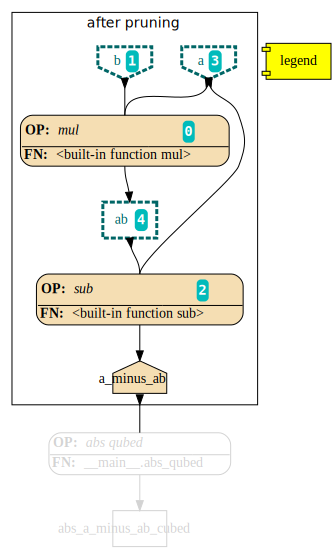
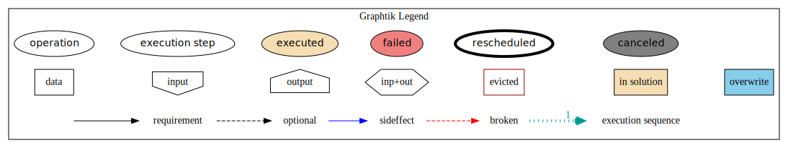

Graphtik
========

|python-ver| |dev-status| |gh-version| |pypi-version| |travis-status|
|doc-status| |cover-status| |codestyle| |proj-lic|

|gh-watch| |gh-star| |gh-fork| |gh-issues|

.. epigraph::

    It's a DAG all the way down!

    |sample-plot|

Lightweight computation graphs for Python
-----------------------------------------

**Graphtik** is an an understandable and lightweight Python module for building and
running ordered graphs of computations.
The API posits a fair compromise between features and complexity, without precluding any.
It can be used as is to build machine learning pipelines for data science projects.
It should be extendable to act as the core for a custom ETL engine or
a workflow-processor for interdependent files and processes.

.. Note::
    *Graphtik* sprang from `Graphkit`_ (summer 2019, v1.2.2) to experiment with
    Python 3.6+ features, but has diverged significantly with enhancements ever since.

Quick start
-----------

Here’s how to install:

::

   pip install graphtik

OR with various "extras" dependencies, such as, for plotting::

   pip install graphtik[plot]

. Tip::
    Supported extras:

    **plot**
        for plotting with `Graphviz`_,
    **matplot**
        for plotting in *maplotlib* windows
    **sphinx**
        for embedding plots in *sphinx*\-generated sites,
    **test**
        for running *pytest*\s,
    **dill**
        may help for pickling `parallel` tasks - see `marshalling` term
        and ``set_marshal_tasks()`` configuration.
    **all**
        all of the above, plus development libraries, eg *black* formatter.
    **dev**
        like *all*

Let's build a *graphtik* computation graph that produces x3 outputs
out of 2 inputs `a` and `b`:

- `a x b`
- `a - a x b`
- `|a - a x b| ^ 3`

..

>>> from graphtik import compose, operation
>>> from operator import mul, sub

>>> @operation(name="abs qubed",
...            needs=["a_minus_ab"],
...            provides=["abs_a_minus_ab_cubed"])
... def abs_qubed(a):
...     return abs(a) ** 3

Compose the ``abspow`` function along the ``mul`` & ``sub``  built-ins
into a computation graph:

>>> graphop = compose("graphop",
...     operation(needs=["a", "b"], provides=["ab"])(mul),
...     operation(needs=["a", "ab"], provides=["a_minus_ab"])(sub),
...     abs_qubed,
... )
>>> graphop
NetworkOperation('graphop', needs=['a', 'b', 'ab', 'a_minus_ab'],
                    provides=['ab', 'a_minus_ab', 'abs_a_minus_ab_cubed'],
                    x3 ops: <built-in function mul>, <built-in function sub>, abs qubed)

Run the graph and request all of the outputs:

>>> graphop(a=2, b=5)
{'a': 2, 'b': 5, 'ab': 10, 'a_minus_ab': -8, 'abs_a_minus_ab_cubed': 512}

... or request a subset of outputs:

>>> solution = graphop.compute({'a': 2, 'b': 5}, outputs=["a_minus_ab"])
>>> solution
{'a_minus_ab': -8}

... and plot the results (if in *jupyter*, no need to create the file):

>>> solution.plot('graphop.svg')    # doctest: +SKIP

|sample-sol|
|plot-legend|

.. |sample-plot| image:: docs/source/images/barebone_2ops.svg
    :alt: sample graphtik plot
    :width: 120px
    :align: middle

.. _Graphkit: https://github.com/yahoo/graphkit
.. _Graphviz: https://graphviz.org
.. _badges_substs:

.. |travis-status| image:: https://img.shields.io/travis/pygraphkit/graphtik
    :alt: Travis continuous integration testing ok? (Linux)
    :target: https://travis-ci.org/pygraphkit/graphtik/builds

.. |doc-status| image:: https://img.shields.io/readthedocs/graphtik?branch=master
    :alt: ReadTheDocs ok?
    :target: https://graphtik.readthedocs.org

.. |cover-status| image:: https://img.shields.io/codecov/c/github/pygraphkit/graphtik
    :target: https://codecov.io/gh/pygraphkit/graphtik

.. |gh-version| image::  https://img.shields.io/github/v/release/pygraphkit/graphtik?label=GitHub%20release&include_prereleases
    :target: https://github.com/pygraphkit/graphtik/releases
    :alt: Latest release in GitHub

.. |pypi-version| image::  https://img.shields.io/pypi/v/graphtik?label=PyPi%20version
    :target: https://pypi.python.org/pypi/graphtik/
    :alt: Latest version in PyPI

.. |python-ver| image:: https://img.shields.io/pypi/pyversions/graphtik?label=Python
    :target: https://pypi.python.org/pypi/graphtik/
    :alt: Supported Python versions of latest release in PyPi

.. |dev-status| image:: https://img.shields.io/pypi/status/graphtik
    :target: https://pypi.python.org/pypi/graphtik/
    :alt: Development Status

.. |codestyle| image:: https://img.shields.io/badge/code%20style-black-black
    :target: https://github.com/ambv/black
    :alt: Code Style

.. |gh-watch| image:: https://img.shields.io/github/watchers/pygraphkit/graphtik?style=social
    :target: https://github.com/pygraphkit/graphtik
    :alt: Github watchers

.. |gh-star| image:: https://img.shields.io/github/stars/pygraphkit/graphtik?style=social
    :target: https://github.com/pygraphkit/graphtik
    :alt: Github stargazers

.. |gh-fork| image:: https://img.shields.io/github/forks/pygraphkit/graphtik?style=social
    :target: https://github.com/pygraphkit/graphtik
    :alt: Github forks

.. |gh-issues| image:: http://img.shields.io/github/issues/pygraphkit/graphtik?style=social
    :target: https://github.com/pygraphkit/graphtik/issues
    :alt: Issues count

.. |proj-lic| image:: https://img.shields.io/pypi/l/graphtik
    :target:  https://www.apache.org/licenses/LICENSE-2.0
    :alt: Apache License, version 2.0
