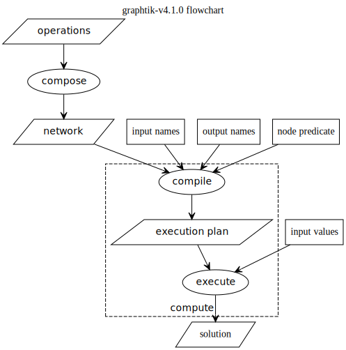

.. _arch:

============
Architecture
============

.. default-role:: term
.. glossary::

    COMPUTE
    computation
        |v410-flowchart|
        The definition & execution of networked operation is splitted in 1+2 phases:

        - `COMPOSITION`
        - `COMPILATION`
        - `EXECUTION`

        ... it is constrained by these IO data-structures:

        - `operation`\(s) (with `needs` & `provides` for each one)

        - given `inputs`
        - asked `outputs`

        ... populates these low-level data-structures:

        - `network graph` (COMPOSE time)
        - `execution dag` (COMPILE time)
        - `execution steps` (COMPILE time)
        - `solution` (EXECUTE time)

        ... and utilizes these main classes:

        .. autosummary::

            graphtik.op.FunctionalOperation
            graphtik.netop.NetworkOperation
            graphtik.network.Network
            graphtik.network.ExecutionPlan
            graphtik.network.Solution

    compose
    COMPOSITION
        The phase where `operation`\s are constructed and grouped into `netop`\s;
        a `network` is assembled for each *netop* during this phase.

        .. Tip::
            - Use :class:`~.graphtik.operation()` builder class to construct
              :class:`.FunctionalOperation` instances.
            - Use :func:`~.graphtik.compose()` factory to prepare the `net` internally,
              and build :class:`.NetworkOperation` instances.

    compile
    COMPILATION
        The *phase* where the :class:`.Network` creates a new `execution plan`
        by `pruning` all `graph` nodes into a subgraph `dag`, and  derriving
        the `execution steps`.

    execute
    EXECUTION
        The *phase* where the :class:`.ExecutionPlan` calls sequentially or parallel
        the underlying functions of all `operation`\s contained in `execution steps`,
        with `inputs`/`outputs` taken from the `solution`.

    graph
    network graph
        The :attr:`.Network.graph` (currently a DAG) contains all :class:`FunctionalOperation`
        and :class:`_DataNode` nodes of some `netop`.

        They are layed out and connected by repeated calls of
        :meth:`.Network._append_operation()` by Network constructor.

        This graph is then `prune`\d to extract the `dag`, and the `execution steps`
        are calculated, all ingridents for a new :class:`ExecutionPlan`.

    dag
    execution dag
        The :attr:`.ExecutionPlan.dag` is a directed-acyclic-graph that contains
        the `prune`\d nodes as build by :meth:`.Network._prune_graph()`.
        This pruned subgraph is used to decide the `execution steps`.
        The containing :class:`ExecutionPlan.steps` instance is cached
        in :attr:`_cached_plans` across runs with inputs/`outputs` as key.

    steps
    execution steps
        The :attr:`ExecutionPlan.steps` contains a list of the operation-nodes only
        from the `dag`, topologically sorted, and interspersed with
        *instruction steps* needed to `compute` the asked `outputs` from the given `inputs`.

        It is built by :meth:`.Network._build_execution_steps()` based on
        the subgraph `dag`.

        There is a single type of *instruction*, :class:`_EvictInstruction`:,
        which evicts items from `solution` as soon as they are not needed
        further down the dag, to reduce memory footprint while computing.

    solution
        A :class:`.Solution` created internally by :meth:`.NetworkOperation.compute()`
        to hold the values of the `inputs`, and those of the generated
        (intermediate and possibly overwritten) `outputs`.
        It is based on a :class:`collections.ChainMap`, to keep one dictionary
        for each `operation` executed +1 for inputs.

        The last operation result wins in the final *outputs* produced,
        BUT while executing, the `needs` of each operation receive the *solution* values
        in **reversed order**, that is, the 1st operation result (or given input) wins
        for some *needs* name.

        Rational:

            During execution we want stability (the same input value used by all operations),
            and that is most important when consuming input values - otherwise,
            we would use (possibly *overwritten* and thus changing)) intermediate ones.

            But at the end we want to affect the calculation results by adding
            operations into some *netop* - furthermore, it wouldn't be very usefull
            to get back the given inputs in case of `overwrites`.

    overwrites
        Values in the `solution` that are written by more than one `operation`\s.

    net
    network
        the :class:`.Network` contains a `graph` of `operation`\s and can
        `compile` an `execution plan` or `prune` a cloned *network* for
        given `inputs`/`outputs`/`node predicate`.

    plan
    execution plan
        the :class:`.ExecutionPlan` that performs the `execution`.

        `Compile`\ed *execution plans* are cached in :attr:`.Network._cached_plans`
        across runs with `inputs`/`outputs` as key.

    inputs
        a dictionary of named input values given to :meth:`.NetworkOperation.compute()`

    outputs
        A dictionary of computed values returned by :meth:`.NetworkOperation.compute()`.

        All computed values are retained in it when no specific outputs requested,
        to :meth:`.NetworkOperation.compute()`, that is, no data-eviction happens.

    operation
        Either the abstract notion of an action with specified `needs` and `provides`,
        or the concrete wraper :class:`.FunctionalOperation` for arbitrary :class:`.callables`.

    netop
    network operation
        The :class:`.NetworkOperation` class holding a `network` of `operation`\s.

    needs
        A list of names of the compulsory/optional values an operation's
        underlying callable requires to execute.

    provides
        A list of names of the values produced when the `operation`'s
        underlying callable executes.

    prune
    pruning
        Method :meth:`.Network._prune_graph()` extracts a subgraph `dag` that
        does not contain any `unsatisfied operation`\s.

        It topologically sorts the `graph`, and *prunes* based on given `inputs`,
        asked `outputs`, `node predicate` and `operation` `needs` & `provides`.

    unsatisfied operation
        Method :meth:`.Network._unsatisfied_operations()` collects all `operation`\s
        that fall into any of these two cases:

        - it has `needs` that do not correspond to any given `inputs` or
          intermediately `compute`\d `outputs` of the `solution`;
        - all its `provides` are NOT needed by any other operation, nor are asked
          as `outputs`.

    predicate
    node predicate
        A callable(op, node-data) that should return true for nodes not to be
        :meth:`~.NetworkOperation.narrowed`.

.. default-role:: obj

